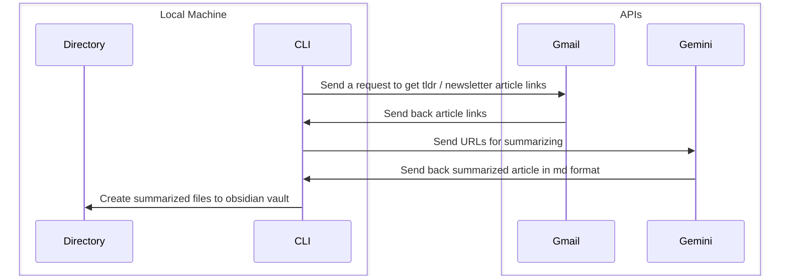

# Design Doc

## Context

The project is about creating a seamless way to have summaries of articles be saved directly to my obsidian vault

## Goals

Reduce time spent on reading the whole article to just get the gist of it

## Design

### Sequence Diagram

### CLI

#### CLI Interface

One option is to indicate date so as to give the system a targeted approach on retrieving necessary articles.

##### Pros

- Easier to figure out which dates am I getting summaries for

##### Cons

- It would be annoying to keep on setting dates every time I run the command

Another option is to let the command check for unread emails and go through the list

##### Pros

- Feels automated, less matter to think about for the interface

##### Cons

- Could get out of control if not careful

I might want to go for option 2 as I don't want to think about useless interface, and it also helps me clean up my email

### Local Directory

- Set up local directory config on the CLI
- Perhaps set up a default setting

### Google API - Gemini

[Google Gemini API has a documentation available](https://ai.google.dev/gemini-api/docs)
Send URL to gemini and ask for it to summarize it for us

We don't want the overload the server and hit the max number of requests right away so we need to add timeouts

### Google API - Gmail

[Official documentation](https://developers.google.com/gmail/api/guides)

Get mail from gmail through the API
Will need to parse data from the email to get all links from TLDR, along with the descriptions they come with.

## Limits of Current Design

Currently, I don't have an idea on how to screen for which links to actually summarize depending on the description.

### Ideas

- Parse description and look for hot words to look for?
- Summarize only ones with 6>= minute reads?
