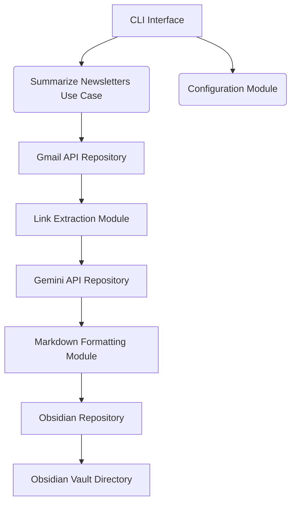

# Design Document: CLI Newsletter Summarizer

## 1. Introduction

**Purpose:**

This document describes the design of a command-line interface (CLI) tool that automates the process of retrieving newsletters from Gmail, summarizing the articles within them using the Gemini API, and saving the summaries as Markdown files to an Obsidian vault.

**Scope:**

This design document covers the architecture, module design, and key decisions for the CLI newsletter summarizer. It focuses on the core functionality of email retrieval, link extraction, summarization, Markdown formatting, and Obsidian integration. It does not cover detailed UI/UX design or deployment specifics at this stage.

**Audience:**

This document is intended for developers, architects, and anyone involved in the development and maintenance of the CLI newsletter summarizer.

**References:**

* Software Requirements Specification (SRS): CLI Newsletter Summarizer
* Gmail API Documentation
* Gemini API Documentation
* Obsidian Documentation

## 2. Architectural Overview

The following diagram illustrates the high-level architecture of the CLI newsletter summarizer.

**Description:**

The system follows a Clean Architecture approach, separating concerns into distinct modules. The CLI Interface receives user commands and triggers the corresponding use cases. The Summarize Newsletters Use Case orchestrates the workflow, interacting with repositories (Gmail API, Gemini API, Obsidian) and modules (Link Extraction, Markdown Formatting). The Configuration Module handles application settings.

* **CLI Interface:** Handles user interaction and command parsing.
* **Summarize Newsletters Use Case:** Orchestrates the workflow for retrieving, summarizing, and saving newsletters.
* **Gmail API Repository:** Handles communication with the Gmail API for email retrieval.
* **Link Extraction Module:** Extracts URLs from email content.
* **Gemini API Repository:** Handles communication with the Gemini API for summarization.
* **Markdown Formatting Module:** Formats summaries as Markdown.
* **Obsidian Repository:** Handles saving Markdown files to the Obsidian vault.
* **Configuration Module:** Handles application configuration.
* **Obsidian Vault Directory:** The directory where the markdown files are stored.

## 3. Module Design (Key Decisions)

### Gmail API Repository

**Authentication (OAuth 2.0):**

* The `golang.org/x/oauth2/google` package will be used for OAuth 2.0 implementation.
* The tool will initiate the browser-based OAuth 2.0 authorization flow, opening a browser window for the user to grant access to their Gmail account.
* The `oauth2.Config` and `oauth2.TokenSource` will be used to manage the token exchange.
* The OAuth token will be securely stored in the system's keychain using the `go-keyring` library.
* The Client ID and Client Secret will be stored as environment variables or in a configuration file, not hardcoded.

**Email Retrieval and Modification:**

* The `users.messages.list` endpoint will be used to retrieve messages.
* The `users.messages.get` endpoint will be used to retrieve the message body.
* The `users.messages.modify` endpoint will be used to mark emails as read after successful processing.
* The `q` parameter in the `users.messages.list` request will be used to filter emails by sender and unread status.
* The `q` parameter will be constructed dynamically based on the user's configured sender addresses and the "is:unread" filter.
* Pagination will be handled using the `pageToken` parameter in the `users.messages.list` request.
* The tool will continue to retrieve messages until all matching unread emails have been processed.
* A configuration option will be provided to allow users to choose whether or not to mark emails as read.

**Error Handling and Rate Limiting:**

* HTTP status codes and error messages returned by the Gmail API will be checked.
* Retry logic with exponential backoff and jitter will be implemented for transient errors (e.g., rate limits).
* Authentication failures will be handled by prompting the user to re-authenticate.
* The standard `log` package will be used to log errors, including detailed error messages, API requests, and responses.
* Rate limit headers from the Gmail API responses will be monitored to track remaining quota.
* If rate limit headers indicate approaching limits, intentional delays will be introduced between API calls.
* A configuration option will be provided to allow users to adjust the delay between API calls.
* The tool will handle HTTP 429 errors (Too Many Requests) by implementing exponential backoff.

**WIP WIP WIP WIP WIP WIP WIP WIP WIP**

### Link Extraction Module

(To be added)

### Gemini API Repository

(To be added)

### Markdown Formatting Module

(To be added)

### Obsidian Repository

(To be added)

### Configuration Module

(To be added)

## 4. Data Structures

(To be added)

## 5. Error Handling

(To be added)

## 6. Testing Strategy

(To be added)

## 7. Deployment (If Applicable)

(To be added)

## 8. Future Considerations

(To be added)
