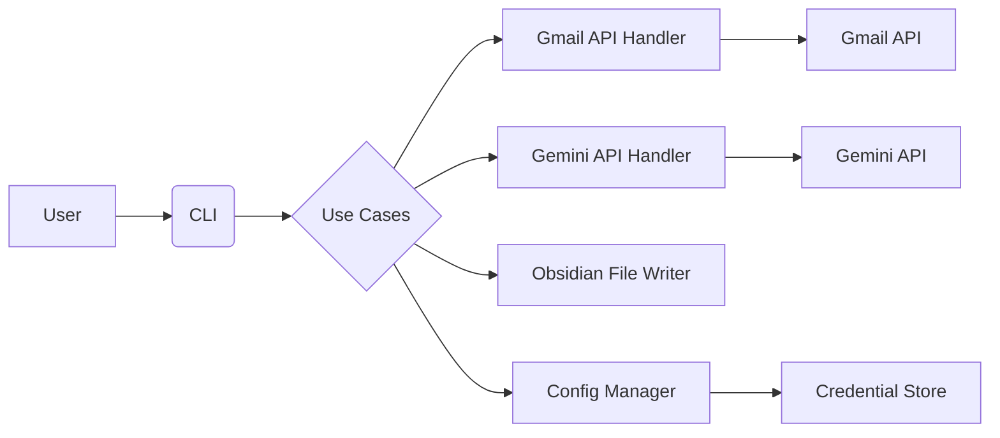

# Design Document: CLI Gmail Newsletter Summarizer

## 1. Introduction

- **1.1 Purpose:**
    - This document outlines the architectural and component design for the CLI Gmail Newsletter Summarizer tool.
- **1.2 Scope:**
    - This document covers the high-level architecture, component descriptions, and data flow of the system.

## 2. Architectural Design

- **2.1 Architectural Style:**
    - Clean Architecture will be employed to ensure separation of concerns, testability, and maintainability.
    - The system will be organized into the following layers:
        - **Entities:** Core business objects (e.g., `Email`, `Article`, `Summary`).
        - **Use Cases (Interactors):** Business logic and application-specific rules.
        - **Interface Adapters:** Translates data between use cases and external systems (e.g., CLI, APIs).
        - **Frameworks & Drivers:** External systems and libraries (e.g., Gmail API, Gemini API, OS credential store).
- **2.2 Component Diagram (High-Level):**

- **2.3 Data Flow:** 
	- The CLI acts as the entry point, receiving user commands. 
	- The CLI translates commands into use case requests. 
	- Use cases orchestrate interactions with external systems via interface adapters. 
	- Data flows between layers according to the Dependency Rule (inward dependencies).