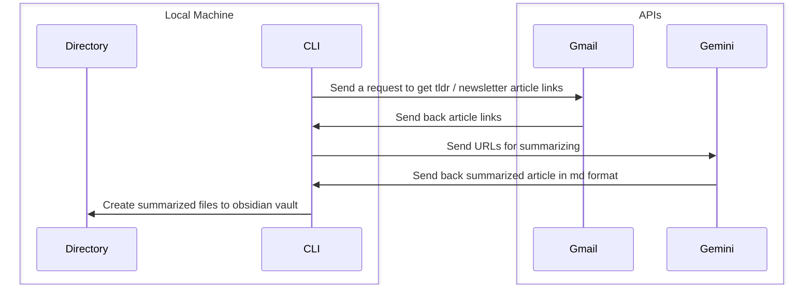
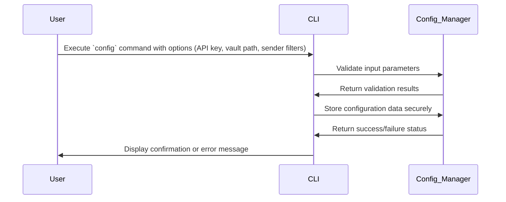
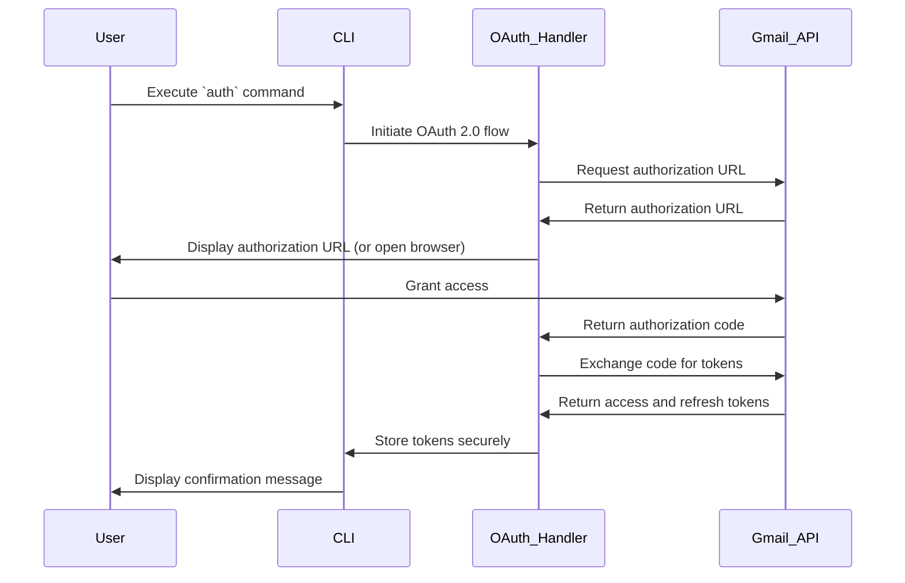
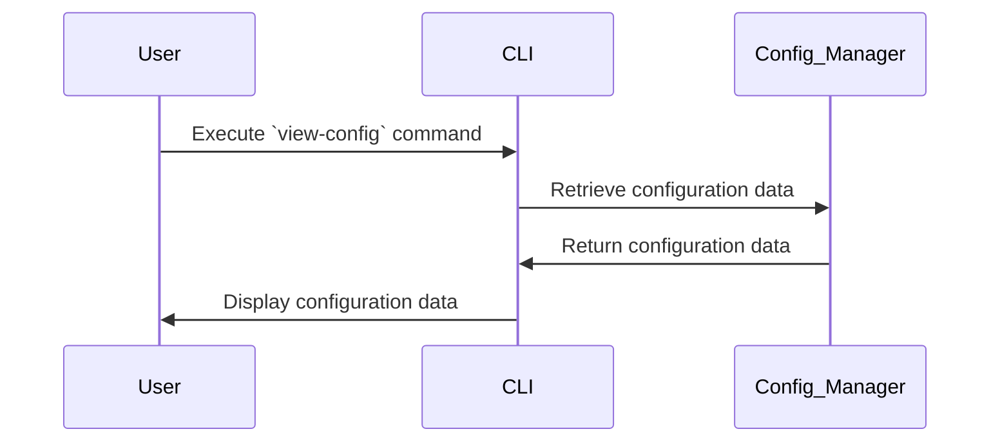

# Software Requirements Specification: CLI Gmail Newsletter Summarizer

## Introduction 
-  **Purpose:** 
	- This document specifies the software requirements for a command-line tool that automates the summarization of newsletter articles from a user's Gmail inbox and saves them as Markdown files in an Obsidian vault. 
- **Scope:** 
	- This tool will retrieve unread emails from a specified Gmail account, extract article links, summarize the article content using the Gemini API, and save the summaries as Markdown files in a user-defined Obsidian vault, including Obsidian-specific Markdown features. 
- **Definitions, Acronyms, and Abbreviations:** 
	- CLI: Command-Line Interface 
	- API: Application Programming Interface 
	- SRS: Software Requirements Specification 
	- OAuth 2.0: Open Authorization 2.0 
	- MD: Markdown 
- **1.4 References:** 
	- Gmail API Documentation 
	- Gemini API Documentation 
	- Obsidian Documentation

## Overall Description

- **Product Perspective:**
  - This is a standalone command-line interface (CLI) tool intended for personal use. It functions independently, interacting with external services (Gmail API, Gemini API) and the local file system (Obsidian vault). It is not part of a larger system.
- **Product Functions:**
  - Retrieves unread newsletter emails from a user's Gmail inbox.
  - Parses and extracts URLs linking to articles from the email content.
  - Sends these URLs to the Gemini API for content summarization.
  - Formats the resulting summaries into Markdown (MD) files, including YAML frontmatter for Obsidian compatibility.
  - Saves the generated MD files to a user-specified directory within their Obsidian vault.
  - Provides configuration options for API keys, vault paths, and sender email filters.
- **User Classes and Characteristics:**
  - The primary users are individuals who:
    - Receive newsletters via Gmail.
    - Utilize Obsidian for personal knowledge management.
    - Possess basic command-line proficiency.
    - Are familiar with API key management and OAuth 2.0 authentication.
- **Operating Environment:**
  - The tool is designed to be cross-platform, compatible with:
    - Windows operating systems.
    - macOS operating systems.
    - Linux operating systems.
  - It requires:
    - An active internet connection for API communication.
    - The Go programming language runtime environment.
- **Design and Implementation Constraints:**
  - The tool must:
    - Use the Gmail API for email retrieval.
    - Use the Gemini API for article summarization.
    - Generate Markdown files that are fully compatible with Obsidian, including YAML frontmatter.
    - Implement OAuth 2.0 for secure Gmail API authentication.
- **User Documentation:**
  - A comprehensive README file will be provided, detailing:
    - Installation procedures.
    - Usage instructions.
    - Configuration details.
  - An integrated help command within the CLI will offer quick access to usage information.
## Design

## Specific Requirements

- **Functional Requirements:**
    - **Gmail API Integration:**
        - FR-1: Authenticate with the Gmail API using OAuth 2.0.
        - FR-2: Retrieve unread emails from the user's inbox.
        - FR-3: Filter emails based on sender addresses provided by the user.
        - FR-4: Mark processed emails as read.
        - [Official documentation](https://developers.google.com/gmail/api/guides)
    - **Link Extraction:**
        - FR-5: Parse the email body and extract URLs.
        - FR-6: Handle various HTML link formats.
    - **Gemini API Integration:**
        - FR-7: Send extracted URLs to the Gemini API for summarization.
        - FR-8: Handle Gemini API authentication and rate limiting.
        - FR-9: Extract the summary from the Gemini API's JSON response.
        - [Google Gemini API has a documentation available](https://ai.google.dev/gemini-api/docs)
    - **Markdown Formatting:**
        - FR-10: Format summaries as Markdown (headings, paragraphs, lists).
        - FR-11: Include metadata: title, source URL, retrieval date, sender email.
        - FR-11.1: Include YAML frontmatter in Markdown files with fields for title, source, date, and sender.
    - **Obsidian Integration:**
        - FR-12: Save Markdown files to a user-specified Obsidian vault directory.
        - FR-13: Create unique filenames for each summary.
        - FR-14: Create folders based on the sender's email address.
    - **Configuration:**
        - FR-15: Allow users to configure the Obsidian vault path.
        - FR-16: Allow users to configure the Gemini API key.
        - FR-17: Allow users to configure sender email address filters.
        - FR-18: Handle Gmail OAuth 2.0 authentication.
    - **CLI Interface:**
        - FR-19: Provide a user-friendly CLI with clear commands and options.
            - The CLI should be designed with a consistent and intuitive command structure, adhering to common CLI conventions.
            - Commands should be grouped logically, and options should be clearly named and documented.
            - The CLI should provide a help system to guide users through available commands and options.
        - FR-20: Provide informative output and error messages.
            - The CLI should provide clear and concise output to inform the user about the progress of operations.
            - Error messages should be specific and actionable, providing guidance on how to resolve the issue.
            - The CLI should use appropriate logging mechanisms to record detailed information about errors and events.
        - FR-21: Implement commands: `config`, `auth`, `summarize`, `view-config`.
            - `config`:
                - Allows users to set configuration parameters (API keys, vault path, sender filters).
                - Should store configurations in a persistent, secure manner.
                - Should validate input parameters and provide feedback to the user.
                - *Clean Architecture Note:* This command interacts with the "Interface Adapters" layer, translating user input into data structures that can be used by the "Use Cases" layer.
            - `auth`:
                - Initiates the OAuth 2.0 authentication flow with the Gmail API.
                - Should securely store the authentication tokens.
                - *Clean Architecture Note:* This command interacts with the "Frameworks & Drivers" layer (Gmail API) and the "Interface Adapters" layer (for token management).
            - `summarize`:
                - Triggers the newsletter summarization process.
                - Should provide progress updates to the user.
                - Should handle potential errors during email retrieval, link extraction, and summarization.
                - *Clean Architecture Note:* This command orchestrates the "Use Cases" layer, which in turn interacts with the "Interface Adapters" and "Frameworks & Drivers" layers.
            - `view-config`:
                - Displays the current configuration settings.
                - Should present the information in a clear and readable format.
                - *Clean Architecture Note:* This command retrieves configuration data from the "Interface Adapters" layer and presents it to the user.
        - Clean Architecture Integration Notes:
            - The CLI interface should act as the "Interface Adapters" layer, responsible for translating user input into requests for the "Use Cases" layer.
            - The CLI should avoid implementing business logic directly.
            - The CLI should focus on presentation and interaction with the user.
            - The use of a CLI library such as Cobra, or Pflag is recommended.
- **Non-Functional Requirements:**
    - Security:
        - NFR-1: Securely handle Gemini API keys.
        - NFR-2: Use OAuth 2.0 for Gmail API authentication.
        - NFR-3: Avoid storing sensitive data in plain text.
    - Performance:
        - NFR-4: Ensure efficient email retrieval and processing.
        - NFR-5: Minimize the time taken for summarization.
    - Reliability:
        - NFR-6: Handle network and API errors gracefully.
        - NFR-7: Prevent data loss.
    - Maintainability:
        - NFR-8: Adhere to Clean Architecture principles.
        - NFR-9: Follow Go coding best practices.
    - Usability:
        - NFR-10: Provide easy configuration and usage.
        - NFR-11: Offer clear documentation.
    - Error Handling:
        - NFR-12: Log all errors.
        - NFR-13: Display clear error messages to the user.

## Use Cases

- **Configure Settings:**
    - The user configures API keys, Obsidian vault path, and sender email filters.
    - **Actor:** User
    - **Preconditions:** None
    - **Postconditions:** Configuration settings are saved.
    - **Steps:**
        1. User executes the `config` command with appropriate options.
        2. The system validates the input parameters.
        3. The system saves the configuration settings securely.
        4. The system displays a confirmation message.

- **Authenticate Gmail:**
    - The user authenticates with their Gmail account using OAuth 2.0.
    - **Actor:** User
    - **Preconditions:** User has a Gmail account.
    - **Postconditions:** Authentication tokens are stored securely.
    - **Steps:**
        1. User executes the `auth` command.
        2. The system initiates the OAuth 2.0 flow.
        3. The user grants the application access to their Gmail account.
        4. The system receives and securely stores the authentication tokens.
        5. The system displays a confirmation message.

- **Summarize Newsletters:**
    - The user triggers the newsletter summarization process.
    - **Actor:** User
    - **Preconditions:** Configuration settings are saved and Gmail is authenticated.
    - **Postconditions:** Summarized newsletters are saved to the Obsidian vault.
    - **Steps:**
        1. User executes the `summarize` command.
        2. The system retrieves unread emails from the Gmail inbox, filtered by sender.
        3. The system extracts URLs from the email content.
        4. The system sends the URLs to the Gemini API for summarization.
        5. The system formats the summaries as Markdown with frontmatter.
        6. The system saves the Markdown files to the specified Obsidian vault directory.
        7. The system marks processed emails as read.
        8. The system displays a summary of the processed newsletters.

- **View Configuration:**
    - The user views the current configuration settings.
    - **Actor:** User
    - **Preconditions:** Configuration settings are saved.
    - **Postconditions:** Current configuration is displayed.
    - **Steps:**
        1. User executes the `view-config` command.
        2. The system retrieves the current configuration settings.
        3. The system displays the settings in a readable format.

- **Handle Errors:**
    - The system handles and reports encountered errors.
    - **Actor:** System
    - **Preconditions:** Any use case can trigger this.
    - **Postconditions:** Errors are logged and reported to the user.
    - **Steps:**
        1. An error occurs during any operation (API error, network error, file system error, etc.).
        2. The system logs the error with relevant details.
        3. The system displays a clear error message to the user, providing guidance on how to resolve the issue.
## Diagrams

### Summarize Command

### Config Command

### Auth Command

### View-config Command

